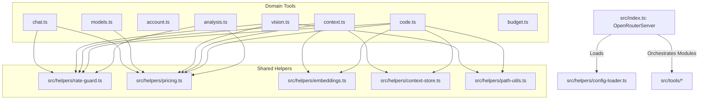

# Repository Review & Core Architecture

> **Product Version:** 1.2.0  
> **Target Platform Profile:** Antigravity (Production-ready)  
> **Review Date:** May 21, 2026  
> **Author:** Antigravity AI Coding Assistant  

---

## 1. Executive Summary

The **Universal MCP for OpenRouter** is a highly sophisticated, production-grade Model Context Protocol (MCP) server that acts as an intelligent, cost-aware gateway to OpenRouter's catalog of 200+ large language models. The codebase is written in highly modular, type-safe TypeScript and utilizes the official `@modelcontextprotocol/sdk` to expose domain-specific developer utilities directly to agentic workflows.

### 🌟 Key Strengths
- **Modular, Decoupled Architecture:** Monolithic structures are separated into clean domain divisions (`src/tools/*` and `src/helpers/*`).
- **State-of-the-Art Cost Safeguards:** Built-in triple-layer protection (budget cap, circuit breakers, and token-bucket rate limiters) acting as a strong defense-in-depth framework.
- **Advanced Context & Search Capabilities:** Combines natural language semantic code search, context pinning, and AST-like symbol extraction.
- **Resilient Model Routing:** Features model fallback chains, dynamic model recommendation, and automated extraction of Chain-of-Thought (`<think>`) reasoning blocks.

---

## 2. Architecture & Design Patterns

The codebase is organized into **Domain-Specific Modular Directories**. Core server code is isolated from actual tool implementations, making the codebase highly extensible and maintainable.

### Module Distribution & Concerns

1. **Server Core (`src/index.ts`)**:
   - Manages MCP lifecycle, Stdio transport, dynamic profile loading (`--profile`), and maps active tool capabilities onto the server handlers.
   - Redirects all standard `console.log` statements to `console.error` to avoid corrupting the MCP Stdio stdout stream.

2. **Core Helpers (`src/helpers/*`)**:
   - **`rate-guard.ts`**: The gatekeeper for API requests, managing pre-flight budget checks, token buckets, and circuit breakers.
   - **`pricing.ts`**: Live-caches OpenRouter model pricing catalog to calculate and persist exact per-token costs.
   - **`embeddings.ts`**: Standardizes vector cosine similarity and requests embeddings (`text-embedding-3-small` / `text-embedding-3-large`).
   - **`context-store.ts`**: Implements thread-safe queued asynchronous JSON file-writes to avoid concurrent write corruption.
   - **`path-utils.ts`**: Exposes validation logic to block unauthorized/sensitive path operations (SSH keys, AWS credentials, system configs).

3. **Domain Tools (`src/tools/*`)**:
   - Each file exposes a `register[Name]Tools` function returning the schema definitions and actual asynchronous request handlers.

---

## 3. Deep-Dive Feature Review

### A. Cost-Control & Safety (RateGuard)
The rate-guarding framework is remarkably robust. Before executing any OpenRouter completion or embedding API call, three sequential checks must pass:
1. **In-Process Session Budget Check:** Compares the accumulated cost (in USD) against the session maximum. Throws an error immediately upon exhaustion.
2. **Dynamic Warning System:** Issues a warning to stderr when usage crosses a specific threshold (default: 80%).
3. **Model Circuit Breakers:** Monitors failures per model. If a model encounters 3 consecutive API failures, the breaker opens, rejecting subsequent queries to that model for 60 seconds and suggesting alternatives.
4. **Token-Bucket Rate Limiting:** Enforces a rolling request-per-minute ceiling (default: 20 RPM) per model.

> [!NOTE]
> The server persists budgets (`rate_config.json`) across execution lifecycles, ensuring safety persists even if the IDE or host process restarts.

### B. Smart Routing & Presets
- **Preset Catalogs:** Predefines categories (`smart`, `cheap`, `creative`, `fast`, `coder`) containing prioritised model fallback lists (e.g., Claude 3.5 Sonnet, GPT-5.5, Gemini 3.1 Pro, qwen-3.6-flash).
- **Fallback Recovery:** If the primary model fails, the system automatically tries secondary fallback models in sequence, masking transient upstream API downtime.
- **Reasoning Handling:** Captures `<think>` and `</think>` tags dynamically, isolating the developer's Chain-of-Thought logs from final answers. This is a critical usability win when running next-generation models like DeepSeek-R1.

### C. Multi-Repo Code Intelligence & Semantic Memory
- **Lightweight AST Parsing:** `index_project` uses regular expressions to extract key classes, functions, and variables from source code files (`.ts`, `.tsx`, `.js`, `.py`, `.rs`, etc.) to create a centralized symbol index.
- **Deep Semantic Chunking:** `reindex_project` segments codebase files into overlapping code chunks (50 lines with a stride of 40) and obtains vector embeddings via `text-embedding-3-large`.
- **Cosine-Similarity Querying:** Provides a full natural language semantic search (`semantic_code_search`) over the vector store.
- **Context Pinning:** Persistent semantic memory (`pin_context`, `retrieve_context`) using `text-embedding-3-small` backed by thread-safe asynchronous file writes.

### D. System Diagnostics & Graphs
- **Dependency Conflict Checking:** `dependency_graph` parses npm `package.json` and Rust `Cargo.toml` dependencies, finds packages shared across different repositories, and runs dynamic `semver` checks to alert developers to incompatible shared dependency ranges.
- **Error Correlation:** Parses multi-system logs simultaneously, prompting an LLM with structured reliability guidelines to detect cross-system root causes.

---

## 4. Security & Portability Audit

### 🔒 Security Strengths
- **Credential Isolation:** Reads environment variables from both the project root `.env` and the XDG-standard user-level path (`~/.config/openrouter-mcp/.env`), overridable via `OPENROUTER_MCP_ENV_PATH`.
- **Path Traversal Shield:** Employs absolute path sanitization and strict rejection of sensitive/restricted paths (e.g., `.ssh`, `.aws`, `.gnupg`, `/etc/passwd`, `/etc/shadow`) inside helper validations.

### ⚠️ Portability & Migration Safety
* **Cross-Machine Portability:** Stores file paths relative to project root in index JSON files (`symbol_index.json` and `context_store.json`) to enable seamless transition and execution across macOS, Linux, and developer machines.
