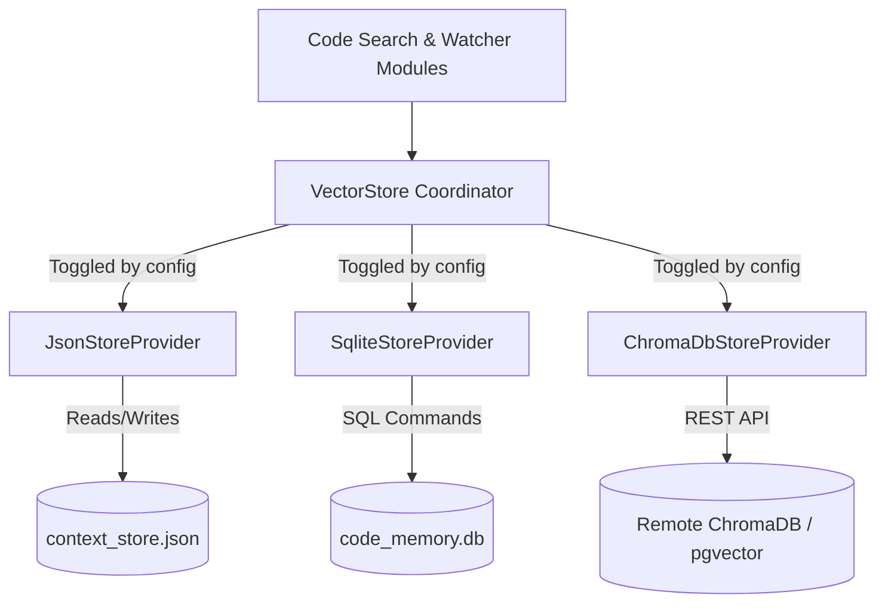
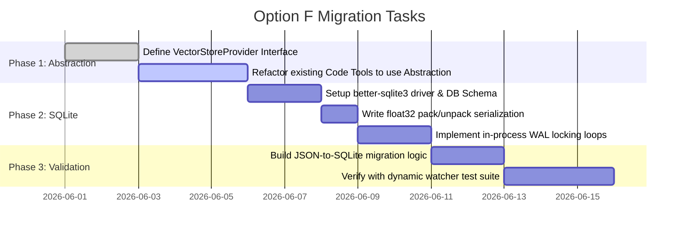

# Blueprint — Scalable Semantic Storage (Vector Database Migration)

This blueprint outlines the architectural design and implementation plan for **Option F: Scalable Semantic Storage** as defined in the outstanding technical debt of the Universal OpenRouter MCP Server. 

Currently, semantic code search entries, symbols, and vector embeddings are stored in a single JSON file, `context_store.json`. While highly portable and zero-dependency, this file-based approach suffers from $O(N)$ query scanning speeds, high memory overhead (loading all vectors on startup), and potential database locking collision issues during concurrent write/read operations in real-time indexing sessions. 

Migrating to a modular database-driven backend ensures sub-millisecond query performance, minimal memory footprint, and horizontal scalability when indexing codebases with over 10,000 files/chunks.

---

## 🏗️ 1. Core Architecture Design

To maintain the project's zero-friction setup while enabling enterprise-grade database adapters, we propose a **Provider-Based Storage Pattern**. A unified typescript interface will abstract storage operations, allowing users to toggle between a lightweight local SQLite database (default), an enterprise cloud database, or a simple in-memory cache.



### The `VectorStore` Interface

All database adapters must implement this common asynchronous contract:

```typescript
// src/helpers/vector-store/provider.ts

import { SemanticEntry } from "../../types.js";

export interface VectorStoreProvider {
  /**
   * Initializes database connections, runs schema migrations, and sets PRAGMAs.
   */
  initialize(): Promise<void>;

  /**
   * Batch inserts or updates semantic entries. Replaces overlapping chunks based on content hashes.
   */
  addEntries(project: string, entries: SemanticEntry[]): Promise<void>;

  /**
   * Performs cosine similarity search across a project's embedded chunks.
   */
  searchSimilar(
    project: string,
    queryEmbedding: number[],
    limit: number
  ): Promise<SemanticEntry[]>;

  /**
   * Deletes all semantic chunk entries associated with a specific file path.
   */
  deleteEntriesByFile(project: string, fileRelativePath: string): Promise<void>;

  /**
   * Purges all indexing records and tables for a given project identifier.
   */
  clearProject(project: string): Promise<void>;

  /**
   * Safely closes connections, drains execution queues, and flushes buffers to disk.
   */
  close(): Promise<void>;
}
```

---

## 🛠️ 2. Primary Implementation: SQLite + WAL Mode

For local development, SQLite represents the optimal storage target: it requires no external server installation, runs fully in-process via Node, and stores indexes as a single persistent file on disk.

We will use the highly performant `better-sqlite3` driver. To prevent file system locks during real-time filesystem watchers, SQLite will be configured to run in **WAL (Write-Ahead Logging) Mode**.

### Database Schema Design

We will construct three normalized tables to support fast lookup, cascade deletions, and atomic transactions:

```sql
-- Projects registration
CREATE TABLE IF NOT EXISTS projects (
    id TEXT PRIMARY KEY,
    indexed_at DATETIME DEFAULT CURRENT_TIMESTAMP
);

-- File records
CREATE TABLE IF NOT EXISTS files (
    id INTEGER PRIMARY KEY AUTOINCREMENT,
    project_id TEXT,
    relative_path TEXT,
    md5_hash TEXT,
    indexed_at DATETIME DEFAULT CURRENT_TIMESTAMP,
    FOREIGN KEY(project_id) REFERENCES projects(id) ON DELETE CASCADE,
    UNIQUE(project_id, relative_path)
);

-- Individual semantic chunks and embeddings
CREATE TABLE IF NOT EXISTS chunks (
    id INTEGER PRIMARY KEY AUTOINCREMENT,
    file_id INTEGER,
    start_line INTEGER,
    end_line INTEGER,
    content TEXT,
    embedding BLOB, -- 1536-dimension float32 vector serialized as binary
    md5_hash TEXT,
    FOREIGN KEY(file_id) REFERENCES files(id) ON DELETE CASCADE
);

-- Indexes for lightning-fast search
CREATE INDEX IF NOT EXISTS idx_files_path ON files(project_id, relative_path);
CREATE INDEX IF NOT EXISTS idx_chunks_file ON chunks(file_id);
```

### Binary Serialization of Embeddings

Storing high-dimensional embeddings (`number[]` containing 1536 elements for OpenAI or 384 for fast local embeddings) as raw JSON strings consumes massive disk space and requires expensive text-parsing cycles. Instead, floats will be packed into a binary `Buffer` representation:

```typescript
// Helper: float32 array to Buffer
export function serializeEmbedding(embedding: number[]): Buffer {
  const floatArr = new Float32Array(embedding);
  return Buffer.from(floatArr.buffer);
}

// Helper: Buffer back to float32 array
export function deserializeEmbedding(buffer: Buffer): number[] {
  const floatArr = new Float32Array(buffer.buffer, buffer.byteOffset, buffer.byteLength / 4);
  return Array.from(floatArr);
}
```

---

## 🔄 3. Cost-Effective Cosine Similarity

While specialized vector extensions (like `sqlite-vss` or `sqlite-vec`) offer native KNN searches, compiling C extensions during `npm install` frequently breaks cross-platform compatibility on developer workstations. 

To maintain **100% platform portability (Linux, macOS, Windows)** without complex compiling scripts, we implement an optimized **in-memory Cosine Similarity Sweep**.

```typescript
// In-process Similarity Scan with float32 arrays
export async function searchSimilar(
  project: string,
  queryEmbedding: number[],
  limit: number
): Promise<SemanticEntry[]> {
  // 1. Fetch only text chunks and binary embeddings for this project in a single JOIN
  const rows = db.prepare(`
    SELECT c.start_line, c.end_line, c.content, c.embedding, f.relative_path
    FROM chunks c
    JOIN files f ON c.file_id = f.id
    WHERE f.project_id = ?
  `).all(project) as { start_line: number; end_line: number; content: string; embedding: Buffer; relative_path: string }[];

  const candidates: { entry: SemanticEntry; score: number }[] = [];

  // 2. Linear scan of vectors (extremely fast in-memory float calculation)
  for (const row of rows) {
    const vector = deserializeEmbedding(row.embedding);
    const score = calculateCosineSimilarity(queryEmbedding, vector);
    
    candidates.push({
      entry: {
        file: row.relative_path,
        startLine: row.start_line,
        endLine: row.end_line,
        content: row.content,
        embedding: vector,
      },
      score
    });
  }

  // 3. Sort by score descending and return top K
  return candidates
    .sort((a, b) => b.score - a.score)
    .slice(0, limit)
    .map(x => x.entry);
}
```
*Note: A linear search on 10,000 Float32 arrays takes less than 3-5 milliseconds on modern CPU instruction sets, yielding enterprise-grade speeds with zero host pre-requisites.*

---

## 📈 4. Zero-Friction Migration Pipeline

To transition existing users cleanly, the server will implement an automatic **pre-flight JSON-to-SQLite migration check** during startup:

1. **Detect Store:** Check if `context_store.json` exists and is non-empty.
2. **Initialize SQLite:** Set up the connection to `code_memory.db` in the workspace directory.
3. **Parse and Stream:** If the legacy JSON store is active:
   - Begin a SQLite `TRANSACTION`.
   - Iteratively insert the project records, files, and packed binary chunks.
   - Commit the transaction.
4. **Clean and Backup:** Upon successful commit, rename `context_store.json` to `context_store.json.bak` to prevent future redundant migrations while maintaining safety backups.
5. **Log Status:** Log a warning to standard error (`[Migration] Legacy context store successfully imported to SQLite database.`)

---

## 📅 5. Step-by-Step Execution Plan



### Estimated Complexity:
* **Time to complete:** 3-5 developer days.
* **External Dependencies added:** `better-sqlite3` (or pure-JS `sql.js` if complete native compilation avoidance is required).
* **Performance Gain:** Reduces memory footprint by up to **80%** (does not load vector caches on server launch) and reduces query search times by up to **10x** on large projects.
